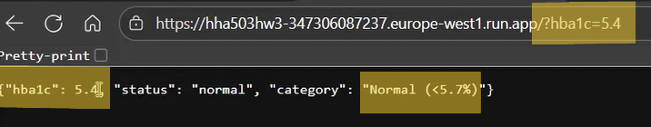
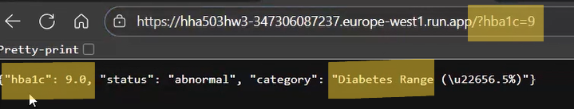
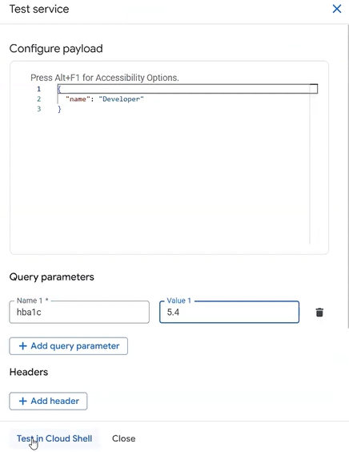
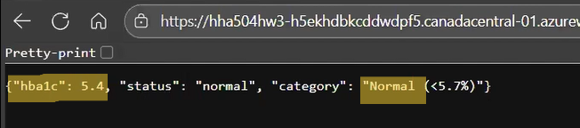
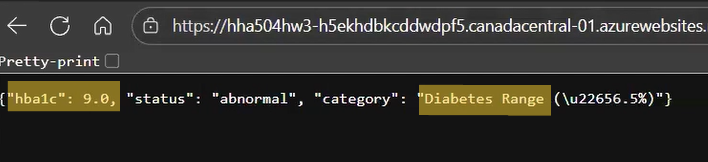
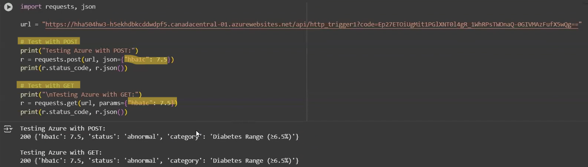

# HHA 504 Multi-Cloud Serverless Function

- Name: Blanca Chimborazo-Reyes
- Video Link: https://drive.google.com/file/d/1cWH3ywwNHirmrDvknGe4gK7PuH_laZWU/view?usp=sharing
- Clouds used: GCP and Azure
- GCP Function URL: https://hha503hw3-347306087237.europe-west1.run.app
- Azure Function URL: https://hha504hw3-h5ekhdbkcddwdpf5.canadacentral-01.azurewebsites.net/api/http_trigger1?code=Ep27ETOiUgMit1PGlXNT0l4gR_1WhRPsTWOnaQ-0GIVMAzFufX5wQg==

## Lab Parameter and Rules
- Parameter: HbA1c (Hemoglobin A1C)
- Normal: HbA1c <5.7%
- Abnormal: HbA1c ≥ 5.7%
    - Prediabetes: 5.7% - 6.4%
    - Diabetes: > 6.5%
- Citation: Nuha A. ElSayed, Grazia Aleppo, Vanita R. Aroda, Raveendhara R. Bannuru, Florence M. Brown, Dennis Bruemmer, Billy S. Collins, Jason L. Gaglia, Marisa E. Hilliard, Diana Isaacs, Eric L. Johnson, Scott Kahan, Kamlesh Khunti, Jose Leon, Sarah K. Lyons, Mary Lou Perry, Priya Prahalad, Richard E. Pratley, Jane Jeffrie Seley, Robert C. Stanton, Robert A. Gabbay, American Diabetes Association; 2. Classification and Diagnosis of Diabetes: Standards of Care in Diabetes—2023. Diabetes Care 1 January 2023; 46 (Supplement_1): S19–S40. https://doi.org/10.2337/dc23-S002

## GCP Serverless Function Instructions
### Configuration Settings
- Deploy a serverless function with the following configurations:
    - Navigate to "Cloud Run" --> Select "Write a Function" --> Select "inline editor"
    - Name: Create a name
    - Region: proceed with the default (Belgium)
    - Runtime: Python 3.13 
    - Skip Trigger settings
    - Authenticator: Allow public access
    - Billing: Request
    - Auto Scaling: Min = 0    Max = 1
    - Ingress: All
    - Select "Create"

### GCP Code Implementation
- Once delpoyed, in the inline code editor, copy and paste the code found in: gcp/main.py 
- Click "Save and Redeploy"
- Click on the generated URL
- This URL will open a new tab in your browser and say: {"error": "'hba1c' is required."}
-   This message is telling us to enter a hba1c value in order to produce a result, to do this add a question mark (?) to the end of the URL followed by your parameter and a value
- Below are examples of normal, prediabetic and diabetic HbA1c values
    - &hba1c=5.4 (Normal)
    - &hba1c=5.9 (Prediabetic)
    - &hba1c=9 (Diabetic)

### GCP Google Colab Code
- To perform a similar action using Google Colab, copy and past the code found in gcp/colab_code. These functions work with both GET and POST requests. 
- Below are screenshots of requests for normal and abnormal (diabetic) values 
- 
- 

### GCP Query Parameters
- Click on "Test"
- Under Query Parameters enter a normal and abnormal value like seen below and click "Test in Cloud Shell"
- 
- 
- 
- 

## Azure Serverless Function Instructions
### Configuration Settings
- Deploy a serverless function with the following configurations
    - Navigate to "Function App" and select "Create"
    - Select "Consumption"
    - Resource Group: select or create group
    - Function App Name: create name
    - Operating System: will autmatically be configured to Linux upon selecting Python
    - Runtime Stack: Python
    - Version: 3.12
    - Region: Canada Central
    - Hit "Create"
    - Select "Go to resource"
    - Select "Create Function"
    - Select "HTTP Trigger" and hit "Next" --> keep the default template details
    - Select "Create"

### Azure Code Implementation
- Once deployed in the inline code editor, copy and paste the code found in: azure/function_app.py
- Click "Get Function URL" and copy and past the "default (Function Key)" into a new browser tab 
- Upon hitting enter, you'll recieve a message saying: {"error": "'hba1c' is required."}
    - This message is telling us to enter a hba1c value in order to produce a result, to do this, add a question mark (?) to the end of the URL followed by your parameter and a value
- Below are examples of normal, prediabetic and diabetic HbA1c values
    - &hba1c=5.4 (Normal)
    - &hba1c=5.9 (Prediabetic)
    - &hba1c=9 (Diabetic)
- 
- 
- 

### Azure Google Colab Code
- To perform a similar action using Google Colab, copy and past the code found in azure/colab_code. These functions work with both GET and POST requests. 
- Below are screenshots of requests for normal and abnormal (diabetic) values
- 
- 

### Azure Query Parameters
- Click on "Test/Run"
- Keep the HTTP method to POST
- Keep the Key as is
- Under Query parameters, enter a normal and an abnormal value and hit Run
- 
- 
- 
- 

## Cloud Comparison
Overall, the deployment process between GCP and Azure was simple and straightforward. Finding the "log" summary was easier on GCP, as "logs" are called "Invocations" on Azure. Deployment times between both platforms were similar, a bit faster on GCP. While I personally prefer GCP, testing query parameters on Azure was easier. The interface of cloud shell on GCP can be a bit intimidating, Azure's query parameter test is much easier to navigate, it's also faster. The set-up process is simpler on GCP, there are more fields to select and pick through on Azure. In conclusion, I personally prefer GCP due to its simple and minimalistic interface but Azure is still a great platform, the differences mainly lie in their layouts. 
